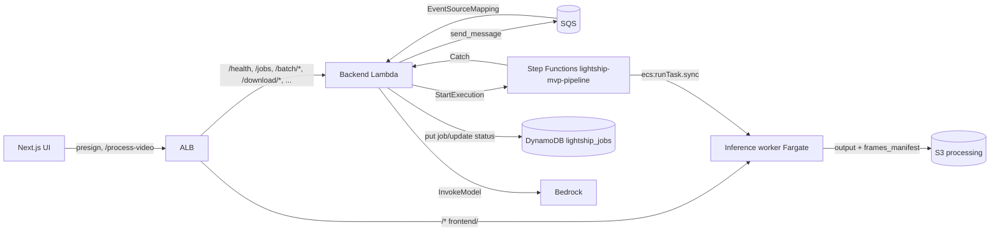

# Lightship MVP — Deployment Guide

Target AWS account: **336090301206** (`role-commit-lightship-devops`).
Region: **us-east-1**. Authorized operator IP: **87.70.177.112/32**.

This guide covers the deployment phases referenced in the plan and matches
the real CloudFormation templates in `infrastructure/`:

1. VPC + networking (`infrastructure/vpc-stack.yaml`)
2. App stack — IAM, ECR, S3, DynamoDB, SQS, SNS, ALB, KMS, Secrets Manager
   (`infrastructure/app-stack.yaml`)
3. Frontend — Next.js on ECS Fargate (`infrastructure/frontend-service-stack.yaml`)
4. Backend — FastAPI on Lambda container + Step Functions pipeline state
   machine + SQS dispatcher (`infrastructure/backend-lambda-stack.yaml`)

The backend stack is where Phase 3 lives: it provisions the **dispatcher
EventSourceMapping**, the **`lightship-mvp-pipeline` state machine**, and
the `PROCESSING_QUEUE_URL` / `PIPELINE_STATE_MACHINE_ARN` env vars on the
backend Lambda.



**Step Functions vs CloudFormation:** `aws cloudformation deploy` on
`backend-lambda-stack.yaml` may report a **circular dependency** between the
Lambda, the SQS mapping, and the state machine (pre-existing template shape).
The live ASL can still be updated with `aws stepfunctions update-state-machine`;
this repo includes `build/patch_sfn_ecs_env.py` as a reference for injecting
ECS container env from the SQS payload’s `ecs_env` object.

**Inference worker image:** Detectron2 is installed with
`detectron2==0.6+18f6958pt2.6.0cpu` (torch 2.6 CPU community wheel); the
string `0.6+pt2.6.0cpu` is **not** valid on the wheel index.

---

## 0. Prerequisites

```bash
aws --version                     # v2
aws sts get-caller-identity       # should show role-commit-lightship-devops
export AWS_REGION=us-east-1
export PROJECT_NAME=lightship
export ENVIRONMENT=mvp
```

## 1. VPC stack

```bash
aws cloudformation deploy \
  --template-file infrastructure/vpc-stack.yaml \
  --stack-name ${PROJECT_NAME}-${ENVIRONMENT}-vpc \
  --parameter-overrides \
      ProjectName=${PROJECT_NAME} Environment=${ENVIRONMENT} \
      VpcCidr=10.145.16.0/20 \
      AvailabilityZone1=us-east-1a AvailabilityZone2=us-east-1b \
  --capabilities CAPABILITY_NAMED_IAM
```

Produces VPC `vpc-mvp-lightship` with six /24 subnets (two public, two
private-app, two private-data), one NAT gateway, shared private route
table, S3/DynamoDB gateway endpoints, and ECR + CloudWatch Logs interface
endpoints.

## 2. App stack

```bash
aws cloudformation deploy \
  --template-file infrastructure/app-stack.yaml \
  --stack-name ${PROJECT_NAME}-${ENVIRONMENT}-app \
  --parameter-overrides \
      ProjectName=${PROJECT_NAME} Environment=${ENVIRONMENT} \
      VPCStackName=${PROJECT_NAME}-${ENVIRONMENT}-vpc \
  --capabilities CAPABILITY_NAMED_IAM
```

Creates:

- ECR repos: `lightship-mvp-frontend`, `lightship-mvp-backend`.
- S3 buckets (KMS SSE via the `alias/lightship-mvp` CMK):
  - `lightship-mvp-processing-<account>` (video ingest + results)
  - `lightship-mvp-lancedb-<account>`
  - `lightship-mvp-conversations-<account>`
  - External: `s3-lightship-custom-datasources-us-east-1` (referenced by IAM).
- DynamoDB `lightship_jobs` (`job_id` PK, `user_id`+`created_at` GSI).
- SQS `lightship-mvp-processing-queue` + DLQ `lightship-mvp-processing-dlq`.
- SNS topic `lightship-mvp-notifications` + alarms on DLQ depth, ALB 5xx, ECS CPU.
- ALB `lightship-mvp-alb` (internet-facing, authorized IP only) with listener rules covering every API path the frontend calls: `/health`, `/process-video`, `/status/*`, `/results/*`, `/download/*`, `/presign-upload`, `/jobs`, `/cleanup/*`, `/process-image`, `/client-configs/*`, `/process-s3-video`, `/process-s3-prefix`, `/video-class/*`, `/frames/*`, `/batch/*`.
- IAM roles: `lightship-mvp-ecs-execution-role`, `lightship-mvp-ecs-task-role`, `lightship-mvp-lambda-role`, `lightship-mvp-sfn-execution-role`.
- Secrets Manager `lightship/mvp/config` (detection thresholds, Bedrock model ID).
- CloudWatch log groups: `/ecs/lightship-mvp-frontend`, `/aws/lambda/lightship-mvp-backend`, `/ecs/lightship-mvp-worker`, `/aws/states/lightship-mvp`.
- CloudWatch dashboard `lightship-mvp-dashboard` with six widgets: ALB RequestCount/5xx, SQS queue depth, ECS CPU/memory, DynamoDB throughput, and — added in Phase 2 — Pipeline Throughput, Rekognition Activity, and Stage Duration p50/p95 (Lightship/Backend EMF namespace).

## 3. Frontend ECS service

```bash
aws cloudformation deploy \
  --template-file infrastructure/frontend-service-stack.yaml \
  --stack-name ${PROJECT_NAME}-${ENVIRONMENT}-frontend \
  --parameter-overrides \
      ProjectName=${PROJECT_NAME} Environment=${ENVIRONMENT} \
  --capabilities CAPABILITY_NAMED_IAM
```

Creates the Fargate task definition + service `lightship-mvp-frontend-service` in `lightship-mvp-cluster`. Image URI should point at the `lightship-mvp-frontend` ECR repo from the app stack.

## 4. Backend Lambda + Step Functions

```bash
aws cloudformation deploy \
  --template-file infrastructure/backend-lambda-stack.yaml \
  --stack-name ${PROJECT_NAME}-${ENVIRONMENT}-backend \
  --parameter-overrides \
      ProjectName=${PROJECT_NAME} Environment=${ENVIRONMENT} \
      ImageUri=336090301206.dkr.ecr.us-east-1.amazonaws.com/lightship-mvp-backend:latest \
  --capabilities CAPABILITY_NAMED_IAM
```

Creates:

- Lambda `lightship-mvp-backend` (Container, 3008 MB, 900 s timeout, VPC-attached).
  - Env vars include `PROCESSING_QUEUE_URL`, `PIPELINE_STATE_MACHINE_ARN`, `LOG_FORMAT=json`, `EMIT_METRICS=true`.
- `AWS::Lambda::EventSourceMapping` from `lightship-mvp-processing-queue` → this Lambda (`BatchSize: 1`, `ReportBatchItemFailures`).
- `AWS::StepFunctions::StateMachine` `lightship-mvp-pipeline` (STANDARD type, 870 s inner timeout, Retry on Lambda transient errors, Catch → MarkFailed → Fail).
- `AWS::Logs::LogGroup` `/aws/vendedlogs/states/lightship-mvp-pipeline` (30 day retention).

Verify:

```bash
aws lambda get-function --function-name lightship-mvp-backend \
  --query 'Configuration.{Env:Environment.Variables,Runtime:Runtime,Memory:MemorySize}'
aws stepfunctions list-state-machines \
  --query "stateMachines[?name=='lightship-mvp-pipeline'].stateMachineArn"
curl -s http://<alb-dns>/health
```

## 5. CI/CD (optional)

```bash
aws cloudformation deploy \
  --template-file cicd/cicd-stack.yaml \
  --stack-name ${PROJECT_NAME}-${ENVIRONMENT}-cicd \
  --capabilities CAPABILITY_NAMED_IAM
```

Creates two CodeBuild projects — `lightship-mvp-frontend` (uses `ui-fe/buildspec.yml`) and `lightship-mvp-backend` (uses `lambda-be/buildspec.yml`). **Note:** the stack does *not* create the CodeCommit repo; it expects `lightship-ai-mvp` to already exist.

Kick off a build:

```bash
aws codebuild start-build --project-name lightship-mvp-frontend
aws codebuild start-build --project-name lightship-mvp-backend
```

## 6. End-to-end smoke

```bash
pytest tests/ -v                  # offline contract + metrics + batch tests
TEST_VIDEO_S3_KEY=input/videos/sample/clip.mp4 \
  pytest tests/test_e2e_live.py -v -k "not skipif"
```

Or manually via the ALB URL:

1. Upload: `curl "http://<alb-dns>/presign-upload?filename=clip.mp4"`, then PUT the bytes to the returned URL.
2. Start: `curl -X POST http://<alb-dns>/process-video -F s3_key=<key>`.
3. Poll: `curl http://<alb-dns>/status/<job_id>` — expect `progress` to climb through `0.1 → 0.3 → 0.9 → 1.0`.
4. Inspect:
   - `GET /download/json/<job_id>` — core output JSON, includes `rekognition_audit`.
   - `GET /client-configs/<job_id>` — four client config families.
   - `GET /frames/<job_id>` — annotated frame manifest with presigned URLs.
   - `GET /download/frames-zip/<job_id>` — ZIP bundle of annotated frames + JSON.
5. Confirm pipeline path: `aws stepfunctions list-executions --state-machine-arn arn:aws:states:us-east-1:336090301206:stateMachine:lightship-mvp-pipeline --max-items 5` — every COMPLETED job should have a SUCCEEDED execution.

## 7. Updates

Re-run CodeBuild, or push a new image and update the Lambda / ECS service directly (see `infrastructure/deploy.sh`).

## 8. Appendix — known stack-name / service-name matrix

| Resource | Name | Stack |
|---|---|---|
| VPC stack | `lightship-mvp-vpc` | `vpc-stack.yaml` |
| App stack | `lightship-mvp-app` | `app-stack.yaml` |
| Frontend stack | `lightship-mvp-frontend` | `frontend-service-stack.yaml` |
| Backend stack | `lightship-mvp-backend` | `backend-lambda-stack.yaml` |
| CICD stack | `lightship-mvp-cicd` | `cicd-stack.yaml` |
| ECS cluster | `lightship-mvp-cluster` | app |
| ECS service | **`lightship-mvp-frontend-service`** | frontend |
| Backend Lambda | `lightship-mvp-backend` | backend |
| State machine | `lightship-mvp-pipeline` | backend |
| SQS queue | `lightship-mvp-processing-queue` | app |
| SQS DLQ | `lightship-mvp-processing-dlq` | app |
| DynamoDB | `lightship_jobs` | app |

If your tooling references `lightship-mvp-frontend-svc` (a historical
shortening), update it to `lightship-mvp-frontend-service` — the
CloudFormation template names the ECS service with the full word.
