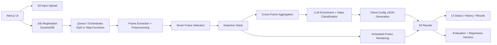

# Lightship MVP Execution Plan

Last updated: 2026-04-17

## 1. Purpose

This document turns the current repository and project materials into a practical execution plan for the Lightship MVP.

The immediate goal is not to optimize the pipeline yet, but to:

- understand the product and acceptance criteria end-to-end
- identify what already exists in the repository
- expose the gaps between the current implementation and the target MVP
- define a precise execution order for implementation, validation, and later optimization

## 2. Primary Source Material

The current repository already contains most of the required source material.

- `docs_data_mterials/Lightship_Project_Overview.md`: consolidated project/business overview
- `docs_data_mterials/Project_Analysis_and_Tool_Selection.md`: model and architecture analysis
- `lightship_mvp_aws_architecture_note.md`: target AWS MVP architecture and service responsibilities
- `product requirements.md`: approved UI user stories and acceptance criteria
- `docs_data_mterials/LightShip_MVP_Task_Management.pdf`: testable requirement matrix and MVP acceptance criteria
- `docs_data_mterials/emails.txt`: client ground-truth schema and requested output/config examples
- `docs_data_mterials/data/config/*.json`: sample config templates expected by the client
- `docs_data_mterials/data/driving/...`: golden dataset, ground truth, renders, and videos
- `docs_data_mterials/UI-Template/`: approved Next.js UI template from product

Repository implementation areas:

- `ui-fe/`: current Next.js frontend
- `lambda-be/`: current FastAPI/Lambda backend and local pipeline code
- `infrastructure/`: CloudFormation stacks and deployment scripts
- `cicd/`: CI/CD infrastructure template

## 3. Current Repository Status

### 3.1 What already exists

- The approved UI template has already been copied into `ui-fe/` and is visually close to the product-approved design.
- The backend already includes:
  - a FastAPI API layer
  - a Lambda entrypoint
  - local pipeline orchestration
  - frame extraction
  - snapshot selection
  - a separate HOG/PCA/KMeans frame selector implementation
  - evaluation scripts
- The infrastructure folder already defines core AWS building blocks such as:
  - VPC
  - ECS frontend
  - Lambda backend
  - S3
  - DynamoDB
  - SQS
  - IAM
  - CloudWatch
- The repository already contains golden data, ground truth, config examples, and customer output expectations.

### 3.2 Gaps discovered during review

| Area | Observed state | Execution impact |
|---|---|---|
| UI template adoption | `ui-fe/src` mostly mirrors `docs_data_mterials/UI-Template/src` | The approved UI is already present, so implementation should focus on backend wiring rather than redesign |
| UI runtime behavior | `ui-fe/src/components/eval-report.tsx` and `ui-fe/src/app/run/page.tsx` still use local state and mock run flow | The frontend is not yet truly connected to the processing backend |
| Results/history flow | `ui-fe/src/app/results/[runId]/page.tsx` and `ui-fe/src/app/history/page.tsx` rely on in-memory flow state | Historical runs and persistent results are not production-ready yet |
| API contract mismatch | `ui-fe/src/lib/api-client.ts` expects routes/fields that do not fully match `lambda-be/src/api_server.py` | Frontend/backend integration will fail until contracts are normalized |
| Missing route alignment | Frontend expects `GET /pipeline-result/{jobId}` and an array from `/jobs`; backend currently exposes `GET /results/{job_id}` and returns `{ "jobs": [...] }` | The API surface must be frozen before UI integration work continues |
| Upload contract mismatch | Frontend presign flow expects `upload_url`; backend currently returns `presign_url` | Direct S3 upload flow is broken as-is |
| Model strategy drift | Current backend still reflects a YOLO/CV/LLM-heavy path, while project docs define Rekognition-primary MVP direction | We need to pick and freeze the MVP detector strategy before benchmarking |
| Frame-selection drift | `lambda-be/src/frame_selector.py` implements HOG/PCA/KMeans, but the main pipeline still uses `snapshot_selector.py` | The smart selector idea exists, but is not yet integrated or evaluated |
| Async orchestration drift | Architecture docs target SQS + Step Functions, but `lambda-be/src/api_server.py` currently self-invokes Lambda asynchronously | Current runtime path and target MVP architecture are not yet aligned |
| Deployment drift | `DEPLOYMENT.md`, `DEPLOYMENT_STATUS.md`, and `infrastructure/deploy.sh` still reference old names and older app structure | Deployment/handover risk is high unless documentation is cleaned up |
| Single image mode gap | Required in docs and task matrix, but the current Next.js flow is video-first | Job-site image mode still needs product wiring and API support validation |
| Evaluation coverage gap | Existing evaluation code focuses mainly on object-level matching | MVP acceptance requires broader KPI coverage: lanes, signs, construction, classification, weather, and PoC-vs-MVP comparison |

## 4. Target MVP Architecture

The target MVP should be treated as an asynchronous batch pipeline with one consistent path from UI to storage, processing, validation, and downloadable output.

Recommended detection split for MVP:

- Rekognition as the primary managed detector for general road objects and broad visual labels
- dedicated lane-detection logic for lane polygons and lane-specific geometry
- optional fallback/custom path for weak classes such as construction-specific objects or sign/light refinement
- LLM enrichment for video-level classification, config generation, weather/road-type reasoning, and missing semantic fields

## 5. Recommended Frame-Selection Strategy

### 5.1 Recommendation

The HOG + PCA + KMeans approach is a valid baseline, but it should not be the only frame-selection strategy for this project.

For Lightship, the best-practice direction is:

1. cheap temporal reduction
2. quality filtering and near-duplicate removal
3. event-sensitive candidate scoring
4. diversity selection inside time windows
5. event-window re-expansion around detected hazards

In other words:

- use clustering as a diversity reducer
- do not use clustering alone as the main hazard-preservation mechanism

### 5.2 Recommended selection stages

| Stage | Goal | Recommended method |
|---|---|---|
| A. Decode and normalize | Convert source video into a stable working stream | camera-aware FPS normalization, orientation normalization, timestamp extraction |
| B. Reject unusable frames | Remove low-value frames early | blur detection, black-frame detection, duplicate/near-duplicate filtering, corrupted-frame rejection |
| C. Generate candidates | Preserve moments likely to contain events | temporal sampling, SSIM/perceptual-hash difference, motion energy, optical flow, scene-change score |
| D. Preserve diversity | Avoid keeping many similar frames | HOG/PCA/KMeans, k-center, or embedding-based clustering within temporal windows |
| E. Recover context | Add temporal detail where events matter | re-expand +/-1 to +/-2 seconds around hazard candidates or high-risk detections |

### 5.3 How to use HOG/PCA/KMeans correctly here

Use HOG/PCA/KMeans as:

- a fast baseline
- a fallback when no model-assisted score is available
- a diversity stage after basic candidate generation

Do not use it as:

- the only event detector
- the only deduplication step
- the only method for rain/night/low-visibility scenarios

### 5.4 Preprocessing guidance for Rekognition

For Rekognition-oriented processing, the rule should be:

- preserve the original frame for rendering and audit
- create a separate analysis copy for preprocessing

Recommended analysis-copy preprocessing:

- standardize to a consistent long-side resolution
- deinterlace if the source footage requires it
- apply mild denoising only when noise is visible
- apply light gamma/contrast normalization or CLAHE only for low-light/rain/fog profiles
- avoid aggressive cropping that removes scene context
- optionally create region crops for traffic lights, signs, or lane-focused regions after a coarse pass

Important note:

- heavy enhancement should be profile-driven and measured
- preprocessing must be benchmarked, because over-processing can reduce detector performance as easily as it can improve it

## 6. Phased Execution Plan

### Phase 0: Discovery and Freeze of Source of Truth

Goal:
establish one agreed execution baseline before implementation accelerates.

Work items:

- confirm the canonical requirement set from the task matrix, PRD, and client email schema
- define the canonical output schema adapters
- confirm whether the MVP runtime will be:
  - direct Lambda async dispatch as an interim path, or
  - SQS + Step Functions from the start
- decide which current documents are authoritative and which are obsolete

Exit criteria:

- frozen API contract
- frozen output schema contract
- frozen MVP detector strategy
- written decision log for open architecture choices

### Phase 1: Baseline Platform and UI/Backend Alignment

Goal:
turn the approved UI into a working product shell connected to a real backend.

Work items:

- replace mock run/result/history flows with real API-driven behavior
- normalize API routes and response contracts between `ui-fe` and `lambda-be`
- wire upload, job polling, results retrieval, and history listing
- add single-image mode design and route handling
- normalize S3 output path behavior and job metadata persistence

Exit criteria:

- the frontend can upload, start, track, and retrieve a real run
- historical jobs are persisted and re-openable
- UI and backend contracts are versioned and documented

### Phase 2: Smart Frame Ingestion and Selection

Goal:
reduce cost without losing important hazard evidence.

Work items:

- integrate a frame-selection interface into the main pipeline
- benchmark:
  - naive sampling
  - scene-change sampling
  - HOG/PCA/KMeans diversity selection
  - hybrid event-aware selection
- add camera-specific preprocessing profiles
- implement event-window re-expansion
- measure selected-frame recall against GT frames/hazard windows

Exit criteria:

- one default selector chosen for MVP
- frame budget per video is defined
- selection quality vs. cost is reported and reproducible

### Phase 3: Detection, Tracking, and Scene Enrichment

Goal:
produce schema-ready detections and event evidence on selected frames.

Work items:

- integrate the chosen Rekognition-primary detection path
- define the dedicated lane-detection path
- define road-sign and traffic-signal handling
- define construction/job-site detection path
- implement object tracking and lane-entry hazard logic
- add road type, weather, traffic, and distance enrichment

Exit criteria:

- schema-ready intermediate outputs exist for all key categories
- per-category baseline metrics are measurable on the golden dataset

### Phase 4: Video Classification and Client JSON Generation

Goal:
convert detections into the exact outputs the client expects.

Work items:

- create LLM prompts and structured post-processing for:
  - video class
  - weather
  - road type
  - hazard summaries
  - client config JSON generation
- support all 4 output families:
  - reactivity/braking
  - educational/Q&A
  - hazard detection
  - job site detection
- validate generated outputs against expected schema/templates

Exit criteria:

- output JSON is schema-valid
- generated config files map to the client's expected structure
- outputs are stored under the correct S3 result path

### Phase 5: Validation and Regression Harness

Goal:
make performance measurable and reproducible before optimization starts.

Work items:

- build a canonical evaluation manifest over the existing GT folders
- support schema adapters for GT versions that differ
- compute KPI-level metrics by category, camera, weather, and video type
- compare current MVP runs against PoC baseline
- generate machine-readable and human-readable reports

Exit criteria:

- reproducible evaluation script with no manual steps
- KPI dashboard/report aligned with task matrix
- regression baseline ready for future improvement work

### Phase 6: Hardening, Deployment, and Operational Readiness

Goal:
make the system deployable and supportable in the client AWS account.

Work items:

- clean deployment scripts and infrastructure documentation
- align CloudFormation outputs with real service behavior
- finalize queue/orchestration path
- add CloudWatch dashboards, alarms, and failure visibility
- document runbooks for debugging, cost, accuracy, and output quality

Exit criteria:

- clean deployment to target AWS account
- operational documentation is usable by a new engineer
- architecture diagrams and deployment instructions reflect reality

### Phase 7: Optimization and Custom-Model Phase

Goal:
improve weak categories only after a stable baseline exists.

Work items:

- threshold tuning
- camera-profile tuning
- prompt tuning
- targeted preprocessing experiments
- custom-model path evaluation for weak categories
- if needed, move to a custom trained path such as Rekognition Custom Labels or an alternative detector for categories where the managed baseline is insufficient

Exit criteria:

- measurable uplift over the validated baseline
- optimization changes are justified by benchmark evidence

## 7. Validation Framework

The validation pipeline should be treated as a first-class product component, not as an afterthought.

### 7.1 Canonical benchmark structure

- one dataset manifest per sample
- links to:
  - source video/image
  - GT JSON
  - video class
  - weather
  - camera source
  - split assignment
- support for multiple GT schema revisions through adapters

### 7.2 KPI mapping

| Requirement | Metric | Minimum target |
|---|---|---|
| Motorcycle detection | recall | >= 80% |
| Lane detection | polygon IoU | >= 80% |
| Road-sign detection | precision | >= 80% |
| Construction detection | precision | >= 80% |
| Video classification | accuracy | >= 80% |
| Weather/road-type enrichment | accuracy or exact-match rate | tracked per slice |
| Output JSON validity | schema pass rate | 100% |
| Batch robustness | completion rate | no blocked batch because of one failed job |
| Cost control | average selected frames / video and average inference cost / video | monitored and compared across selector variants |

### 7.3 Validation outputs

Each benchmark run should produce:

- per-category metrics
- per-video metrics
- confusion matrices for video class, weather, and road type
- frame-selection statistics
- failure examples and false-positive/false-negative samples
- PoC-vs-MVP comparison table
- cost and latency summary

## 8. Immediate Next Sprint

This is the recommended order for the first implementation sprint after this planning stage.

1. Freeze the authoritative requirement set and output schema set.
2. Normalize the UI/backend API contract.
3. Replace mock run/results/history behavior in `ui-fe` with real backend integration.
4. Build a canonical GT manifest and adapter layer over the existing data folders.
5. Wire the frame-selector interface into the active backend pipeline.
6. Benchmark naive, scene-change, clustering, and hybrid selection methods.
7. Choose the lane-detection implementation path.
8. Define the schema mapping for weather, distance, road type, and hazard severity.
9. Repair deployment scripts and infrastructure documentation so they match the actual repo.
10. Produce the first baseline evaluation report against the GT dataset.

## 9. Open Decisions and Risks

- Whether the initial MVP runtime should stay on direct async Lambda dispatch or move immediately to SQS + Step Functions
- Which lane-detection method will be treated as the MVP baseline
- Whether job-site detection should use the same primary stack or a separate fallback/custom path
- How much preprocessing actually helps Rekognition for rain, fog, glare, and low-light footage
- Whether distance should remain categorical at MVP stage or move toward a more explicit geometric estimate
- Whether the current GT folders should be unified physically or only through a logical manifest/adapter layer
- Whether the client's 4 config families need additional hidden fields not present in the current examples

## 10. Definition of Success for the Current Stage

The current stage will be considered complete when:

- the team has one agreed execution plan
- the repository has one clear source-of-truth path from UI to backend to evaluation
- implementation phases are ordered and testable
- the validation harness is defined before optimization work begins
- the later optimization/fine-tuning phase has a clean baseline to improve from
