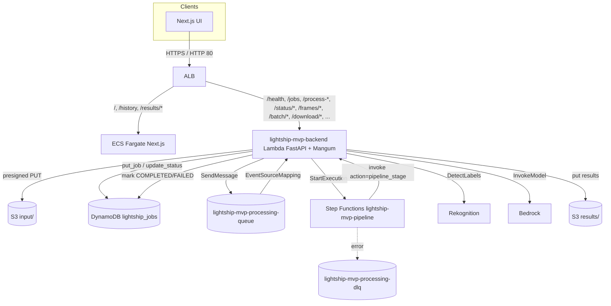

# Lightship MVP — Dashcam Video Analysis Platform

Production-ready AWS MVP for dashcam video ingestion, frame selection,
object / hazard detection, video classification and client-ready config
generation.

Region: **us-east-1**. Account: **336090301206**. VPC CIDR:
**10.145.16.0/20**. Naming follows
[`AWS-NAMING-CONVENTION.md`](AWS-NAMING-CONVENTION.md).

---

## 1. Architecture (actual, as deployed)

Last verified against AWS on 2026-04-26. The live environment is in
`us-east-1`; there is no deployed Route 53 hosted zone or regional WAF Web ACL
for this MVP at the time of verification. See
[`docs/aws-architecture-audit-2026-04-26.md`](docs/aws-architecture-audit-2026-04-26.md)
for the full comparison with the external architecture sketch and the current
Cost Explorer estimate.



**Dispatch path (Phase 3):**

1. UI calls `POST /process-video` (or `/process-s3-video`, or `/batch/process`).
2. Backend Lambda puts the job row into DynamoDB (`status=QUEUED`) and
   `SendMessage`s to SQS.
3. The same backend Lambda doubles as the SQS consumer via an
   `EventSourceMapping` (with `ReportBatchItemFailures`); the dispatcher
   branch calls `StartExecution` on the `lightship-mvp-pipeline` state
   machine.
4. The state machine invokes the backend Lambda again with
   `action: pipeline_stage`; that branch runs `Pipeline.process_video` end
   to end.
5. On failure, the state machine's `Catch` routes to a `MarkFailed` task
   that updates DynamoDB, then the execution transitions to `Fail`.

The legacy Lambda self-invoke path (`action: process_worker`) is still
supported as a fallback when `PROCESSING_QUEUE_URL` is unset — local dev
and un-migrated deployments keep working.

---

## 2. Repository layout

```
├── infrastructure/
│   ├── vpc-stack.yaml                 # VPC, subnets, NAT, endpoints, flow logs
│   ├── app-stack.yaml                 # IAM, ECR, S3, DDB, SQS, SNS, ALB, KMS, Dashboard
│   ├── frontend-service-stack.yaml    # ECS Fargate task + service for the UI
│   ├── backend-lambda-stack.yaml      # Lambda container + SQS consumer + Step Functions state machine
│   ├── state-machines/pipeline.asl.json  # Readable ASL (CFN inlines the same definition)
│   └── deploy.sh                      # One-shot deployment helper
│
├── cicd/
│   └── cicd-stack.yaml                # CodeBuild projects (expects pre-existing CodeCommit repo)
│
├── ui-fe/                             # Next.js 15 App Router (TypeScript, Tailwind)
│   ├── src/app/                       # /, /history, /run, /results/[runId]
│   ├── src/components/                # evaluation/* + shared shell
│   ├── src/lib/api.ts                 # Typed ALB client (presign, process, poll, batch, download zip)
│   ├── src/lib/uuid.ts                # HTTP-safe UUID v4 with getRandomValues + Math.random fallback
│   ├── playwright.config.ts           # e2e config (Chromium)
│   ├── tests/e2e/*.spec.ts            # upload-flow, batch-flow, results
│   └── Dockerfile                     # Standalone Next.js image on port 3000
│
├── lambda-be/                         # FastAPI Lambda container image
│   ├── src/lambda_function.py         # Routes ALB / SFN / SQS / legacy events
│   ├── src/api_server.py              # FastAPI routes + _enqueue_job dispatch helper
│   ├── src/job_status.py              # Warm-cache + DynamoDB progress writes (reserved-word-safe)
│   ├── src/pipeline.py                # V3 orchestrator (CV + Rekognition + Bedrock refine + hazard)
│   ├── src/rekognition_labeler.py     # DetectLabels + per-frame audit for output.json
│   ├── src/utils/logging_setup.py     # JSON-on-Lambda / text-locally
│   ├── src/utils/metrics.py           # CloudWatch EMF emission (stage_timer, count, duration_ms)
│   └── src/config_generator.py        # Four client-config families
│
├── tests/                             # pytest (offline + live)
│   ├── test_api_contracts.py          # 17 offline contract tests (TestClient + stubs)
│   ├── test_08_progress_tracking.py   # Phase 1 progress + reserved-word handling
│   ├── test_metrics_and_logging.py    # Phase 2 EMF metrics + JSON formatter
│   ├── test_dispatcher_and_sqs.py     # Phase 3 SQS enqueue + SFN dispatch
│   ├── test_batch_endpoints.py        # Phase 4 batch + frames-zip
│   ├── test_06_e2e_pipeline.py        # Live-AWS end-to-end (with Rekognition audit check)
│   └── test_e2e_live.py               # Live-ALB smoke covering every new endpoint
│
├── scripts/smoke_browser.md           # Manual HTTP browser smoke checklist
├── .env.example                       # Every env var the system reads
├── .github/workflows/ci.yml           # Backend pytest + UI typecheck/build + Playwright
└── IMPLEMENTATION_STATUS.md           # Phase-by-phase status, test command, and files touched
```

---

## 3. API contract

All routes are served behind the ALB at the URL exposed by the app stack's
`LoadBalancerURL` output.

| Method | Path                                     | Purpose                                                                     |
|--------|------------------------------------------|-----------------------------------------------------------------------------|
| GET    | `/health`                                | Liveness                                                                    |
| GET    | `/jobs?limit=N`                          | List recent jobs from DynamoDB                                              |
| GET    | `/presign-upload?filename=&content_type=`| Presigned PUT + required headers                                            |
| POST   | `/process-video`                         | Form `s3_key` (or direct `video` upload) + `config` JSON                    |
| POST   | `/process-image`                         | Synchronous single-image detection (no job row)                             |
| POST   | `/process-s3-video`                      | `{ s3_uri, config }` — copies into processing bucket if needed              |
| POST   | `/process-s3-prefix`                     | `{ s3_prefix, config }` — one job per matching video object                 |
| POST   | `/batch/process`                         | `{ items: [{ s3_uri \| s3_key \| s3_prefix, filename, config }] }`          |
| GET    | `/batch/status?job_ids=a,b,c`            | One round-trip status for N jobs (unknown ids reported as `NOT_FOUND`)      |
| GET    | `/status/{job_id}`                       | Single-job status + progress (warm cache, Dynamo fallback)                  |
| GET    | `/results/{job_id}`                      | Summary (warm cache, S3 manifest fallback)                                  |
| GET    | `/frames/{job_id}`                       | Annotated-frame manifest with presigned URLs                                |
| GET    | `/video-class/{job_id}`                  | Driving vs Job Site class + metadata                                        |
| GET    | `/client-configs/{job_id}`               | Four client config families                                                 |
| GET    | `/download/json/{job_id}`                | Output JSON (includes `rekognition_audit`)                                  |
| GET    | `/download/frame/{job_id}/{frame_idx}`   | Annotated frame PNG                                                         |
| GET    | `/download/frames-zip/{job_id}`          | ZIP bundle of annotated frames + per-frame JSON + `output.json`             |
| DELETE | `/cleanup/{job_id}`                      | Release warm-cache temp artifacts                                           |

Direct-to-S3 uploads are required in production because the ALB →
Lambda integration has a hard 1 MB payload cap.

---

## 4. Deploy

See [`DEPLOYMENT.md`](DEPLOYMENT.md) for the full four-stack walkthrough.
Short version (requires AWS SSO login + `role-commit-lightship-devops`):

```bash
export AWS_REGION=us-east-1 PROJECT_NAME=lightship ENVIRONMENT=mvp

aws cloudformation deploy --template-file infrastructure/vpc-stack.yaml \
  --stack-name ${PROJECT_NAME}-${ENVIRONMENT}-vpc --capabilities CAPABILITY_NAMED_IAM

aws cloudformation deploy --template-file infrastructure/app-stack.yaml \
  --stack-name ${PROJECT_NAME}-${ENVIRONMENT}-app \
  --parameter-overrides VPCStackName=${PROJECT_NAME}-${ENVIRONMENT}-vpc \
  --capabilities CAPABILITY_NAMED_IAM

aws cloudformation deploy --template-file infrastructure/frontend-service-stack.yaml \
  --stack-name ${PROJECT_NAME}-${ENVIRONMENT}-frontend --capabilities CAPABILITY_NAMED_IAM

aws cloudformation deploy --template-file infrastructure/backend-lambda-stack.yaml \
  --stack-name ${PROJECT_NAME}-${ENVIRONMENT}-backend --capabilities CAPABILITY_NAMED_IAM
```

Or run `bash infrastructure/deploy.sh` for an interactive walkthrough.

---

## 5. Local development

```bash
# Backend
cd lambda-be
python -m venv .venv && .venv/Scripts/activate   # Windows
# source .venv/bin/activate                      # macOS/Linux
pip install -r requirements.txt
uvicorn src.api_server:app --host 0.0.0.0 --port 8000 --reload

# Frontend
cd ui-fe
npm install
NEXT_PUBLIC_API_BASE=http://localhost:8000 npm run dev
```

Leave `PROCESSING_QUEUE_URL` and `PIPELINE_STATE_MACHINE_ARN` empty in
local dev — `/process-video` will run the pipeline in a FastAPI background
task rather than going through SQS/SFN.

---

## 6. Testing

```bash
# Offline — no AWS credentials required
python -m pytest \
  tests/test_08_progress_tracking.py \
  tests/test_api_contracts.py \
  tests/test_metrics_and_logging.py \
  tests/test_dispatcher_and_sqs.py \
  tests/test_batch_endpoints.py -v

# Frontend typecheck + build
cd ui-fe && npx tsc --noEmit && npm run build

# Playwright (starts next start automatically)
cd ui-fe && npx playwright install --with-deps chromium && npx playwright test

# Live ALB (needs AWS creds + optionally TEST_VIDEO_S3_KEY)
AWS_PROFILE=commit-devops-role pytest tests/test_e2e_live.py -v
```

CI (`.github/workflows/ci.yml`) runs the offline suite + build + Playwright
in parallel on every PR.

---

## 7. Observability

- **JSON structured logs** on Lambda — query via CloudWatch Logs Insights:

  ```
  fields @timestamp, level, message, job_id, stage, duration_ms
  | filter level = "ERROR"
  | stats count() by stage
  ```

- **EMF metrics** under `Lightship/Backend`: `PipelineStarts`,
  `PipelineCompletions`, `PipelineFailures`, `RekognitionCalls`,
  `RekognitionLabelsReturned`, `RekognitionInstancesKept`,
  `RekognitionCallMs`, `StageDurationMs` (dim `Stage`), `StageFailures`.

- **Dashboard** `lightship-mvp-dashboard` — ALB, SQS, ECS, DynamoDB plus
  three Phase 2 widgets (pipeline throughput, Rekognition activity, stage
  duration p50/p95).

- **Rekognition audit** — every completed `output.json` carries a
  `rekognition_audit` block with `frames_evaluated`, `total_instances_kept`
  and one entry per frame (raw labels + confidence + latency). Verified by
  `tests/test_06_e2e_pipeline.test_rekognition_audit_present_in_output_json`.

---

## 8. Status + history

See [`IMPLEMENTATION_STATUS.md`](IMPLEMENTATION_STATUS.md) for the
phase-by-phase record. The [`LIGHTSHIP_MVP_EXECUTION_PLAN.md`](LIGHTSHIP_MVP_EXECUTION_PLAN.md)
captures KPI targets and historical gap analysis; the README above
supersedes its architecture section.
