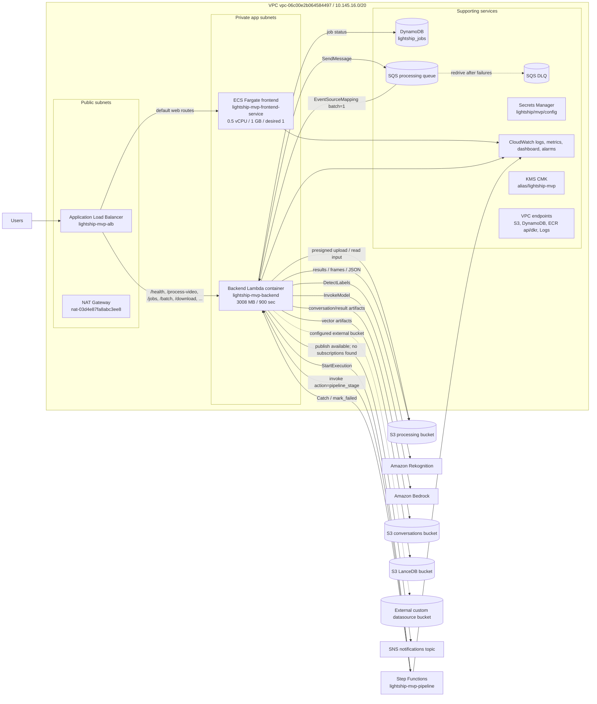

# Lightship MVP AWS Architecture Audit

Audit date: 2026-04-26  
AWS account: `336090301206`  
Region inspected: `us-east-1`  
AWS CLI profile: `lightship`

This document records the deployed AWS architecture observed in the account and
compares it with the high-level architecture sketch. The important correction is
that **Step Functions is deployed and active**. The sketch should be updated to
show it between the SQS dispatcher and the backend Lambda pipeline stage.

## Actual Deployed Architecture

## Comparison With The Provided Sketch

| Component in sketch | Actual status | Notes |
|---|---:|---|
| Users | Present | Users access the public ALB DNS directly. |
| Route 53 | Not deployed | No Route 53 hosted zones were found in this account/profile. |
| AWS WAF | Not deployed | No regional WAF Web ACLs were found in `us-east-1`. |
| Application Load Balancer | Present | `lightship-mvp-alb`, internet-facing, HTTP listener. |
| ECS Fargate web service | Present | One frontend service, desired/running count `1`, task size `512 CPU / 1024 MB`. |
| Backend processing Lambda | Present | Container Lambda `lightship-mvp-backend`, `3008 MB`, `900 sec`, in private app subnets. |
| S3 input/results | Present, but bucket model differs | Main bucket is `lightship-mvp-processing-336090301206`; conversations and LanceDB use separate buckets. |
| SQS processing queue | Present | `lightship-mvp-processing-queue`, encrypted, DLQ configured. |
| Step Functions | Present | `lightship-mvp-pipeline` is `ACTIVE`; this is missing from the provided sketch. |
| Rekognition | Used by backend Lambda | IAM and code path invoke Rekognition; April cost shows usage. |
| Bedrock | Used by backend Lambda | Current Lambda env points to `us.anthropic.claude-sonnet-4-20250514-v1:0`; April cost also shows Claude Haiku usage. |
| DynamoDB job status | Present | `lightship_jobs`, on-demand billing, one `user_id-index`, 75 items at audit time. |
| Secrets Manager | Present | `lightship/mvp/config`. |
| CloudWatch logs/metrics | Present | Lambda/ECS/SFN/VPC flow logs, dashboard and alarms. |
| SNS completion topic | Present, incomplete | Topic exists, but `list-subscriptions-by-topic` returned no subscriptions. |
| ECS worker service | Not deployed | Worker security group/log group exist, but ECS has only the frontend service. Heavy processing currently runs inside Lambda via Step Functions. |

## Cost Snapshot

Cost Explorer for 2026-04-01 through 2026-04-25 reports **$130.77** estimated
unblended cost. Straight-line projection:

- 30-day month: **~$156.92**
- 31-day month: **~$162.15**

Largest observed cost drivers:

| Service | 2026-04-01 to 2026-04-25 | Notes |
|---|---:|---|
| EC2 - Other | `$61.02` | Mostly NAT Gateway hours/bytes and regional transfer. |
| Amazon VPC | `$35.87` | Mostly interface VPC endpoint hours and public IPv4 address charge. |
| ECS Fargate | `$13.07` | One always-on frontend task. |
| Elastic Load Balancing | `$9.49` | ALB hourly and LCU usage. |
| CloudWatch | `$5.84` | Mostly vended log ingestion. |
| CodeBuild | `$3.04` | Build minutes. |
| ECR | `$1.19` | Image storage. |
| KMS + Secrets Manager | `$0.81` | CMK and one secret. |
| Rekognition | `$0.24` | Image processing usage. |
| Bedrock | `$0.18` | Mostly Claude 3 Haiku, with small Sonnet 4.6 usage. |
| S3, SQS, SNS, Step Functions, DynamoDB, Lambda | `<$0.05` each | Low usage during the inspected period. |

## Diagram Update Required

The provided image should be changed as follows:

1. Remove `Amazon Route 53` and `AWS WAF`, or mark both as "planned / not deployed".
2. Insert `AWS Step Functions (lightship-mvp-pipeline)` between the SQS dispatcher and the video processing Lambda.
3. Show the backend as **ALB -> Lambda container** for API routes, not only ECS.
4. Show S3 as three deployed buckets: processing, conversations/results, and LanceDB; the custom datasource bucket is externally referenced and was not inspectable with current permissions.
5. Mark SNS as deployed but without subscribers.
6. Remove or mark any dedicated ECS worker as not currently deployed; processing runs in the backend Lambda pipeline stage.

## Verification Commands Used

- `aws cloudformation list-stacks --region us-east-1`
- `aws cloudformation describe-stack-resources --stack-name lightship-mvp-app`
- `aws cloudformation list-exports`
- `aws stepfunctions describe-state-machine`
- `aws lambda get-function-configuration`
- `aws lambda list-event-source-mappings`
- `aws ecs describe-services`
- `aws ecs describe-task-definition`
- `aws wafv2 list-web-acls --scope REGIONAL`
- `aws route53 list-hosted-zones`
- `aws ce get-cost-and-usage`
